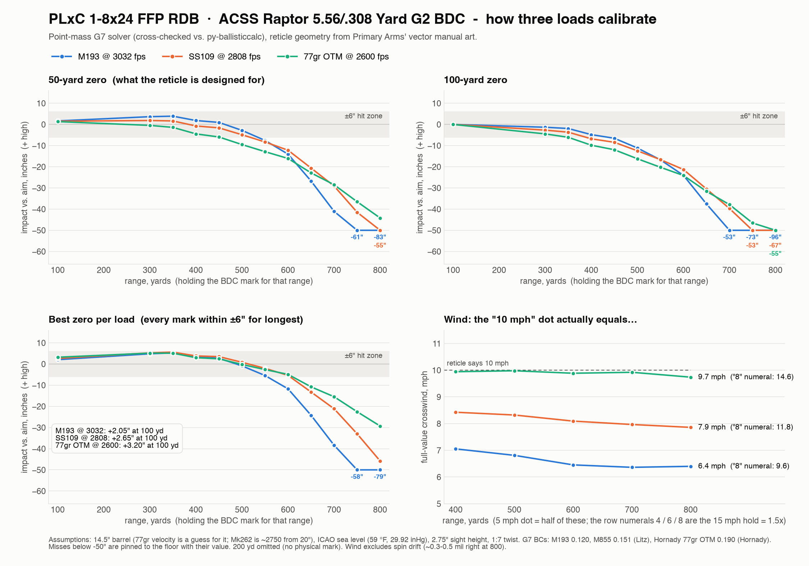
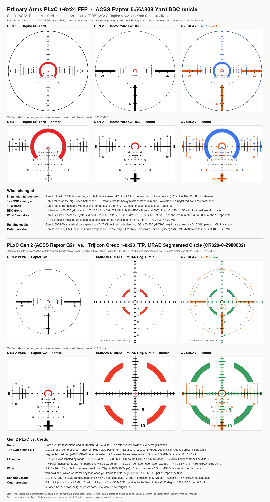

# ballistics

A small external-ballistics solver in Rust, and three studies built on it, all about the
Primary Arms PLxC 1-8x24 FFP RDB scope and its ACSS Raptor 5.56/.308 Yard G2 BDC reticle:

1. **Reticle comparison image.** The old PLxC (Raptor M8 Yard) and the new RDB (Raptor G2) reticles side by side at a common MIL scale, plus an overlay; then the G2 against a Trijicon Credo 1-8x28 FFP MRAD Segmented Circle the same way.
2. **BDC calibration.** How M193 (3032 fps), SS109/M855 (2808 fps) and a Hornady 77gr OTM (2600 fps, a guess) from the user's 14.5" barrel line up with the G2 holdovers and wind holds (5/10 mph dots, 15 mph numerals), at 50 yd, 100 yd, best-fit and Primary Arms' chart zeros.
3. **"Bits per Shot".** A teaching page on KL divergence. It uses Monte Carlo impact clouds for M193 and 77gr from a 14.5" barrel.

### BDC calibration



### Reticle comparison: PLxC Gen 1 vs Gen 2, and Gen 2 vs Trijicon Credo 1-8x28



The reticle images in this comparison are Primary Arms' and Trijicon's own renders, rescaled and overlaid for comparison. They belong to those companies.

Both images are regenerated by `scripts/reproduce.sh`; the full text report is `out/bdc_report.txt` after a run.

For a reviewer: start with [REVIEW.md](REVIEW.md). It lists every claim, its evidence, the assumptions, and the parts I'm least sure of.

## Quick start

```sh
cargo test --release                  # 18 tests: unit, py-ballisticcalc reference, reticle design point
./scripts/reproduce.sh                # regenerate everything into out/ and site/ (~35 s)
cargo run --release --bin traj -- --help
```

`reproduce.sh` needs `cargo`, [`uv`](https://docs.astral.sh/uv/), `curl`, poppler's `pdftocairo`, and ImageMagick's `magick`. The reticle image also uses macOS Helvetica. Python dependencies are pulled per script with `uv run --with ...`. Versions used: numpy 2.4.4, scipy 1.18.1, pandas 3.0.6, matplotlib 3.11.2, svgelements 1.9.6, pillow 12.3.0, py-ballisticcalc 2.3.1. Toolchain: rustc 1.94, edition 2024, no crate dependencies.

## Layout

| Path | What |
|---|---|
| `src/drag.rs` | G1/G7 reference drag tables, PCHIP interpolation |
| `src/atmo.rs` | Moist-air density and speed of sound; ICAO standard at altitude |
| `src/stability.rs` | Miller stability, Litz spin drift and crosswind aerodynamic jump |
| `src/solver.rs` | 3-DOF point mass, RK4, wind, Coriolis, look angle, zeroing |
| `src/reticle.rs` | G2 BDC, wind-hold (5/10/15 mph) and lead-dot subtensions, with provenance |
| `src/bin/traj.rs` | General dope-table CLI |
| `src/bin/bdc.rs` | BDC calibration report (`--csv DIR` for chart data) |
| `src/bin/sensitivity.rs` | Impact vs muzzle-velocity grid for the KL Monte Carlo |
| `tests/reference.rs` | Cross-check vs py-ballisticcalc; Mk262 design-point and wind-hold checks |
| `scripts/extract_reticle.py` | Re-derives `src/reticle.rs` from the manual's vector art and diffs it |
| `scripts/xcheck_pbc.py` | Produces the py-ballisticcalc reference numbers |
| `scripts/plot.py` | BDC calibration chart |
| `scripts/kl.py` | Monte Carlo, exact/Gaussian/k-NN/histogram KL, evidence experiments |
| `scripts/knn_bias_check.py` | Shows the k-NN estimator's low bias on true Gaussians |
| `scripts/build_page.py`, `site/template.html` | The "Bits per Shot" page |
| `scripts/reticle_compare.py` | Gen 1 vs Gen 2, and Gen 2 vs Trijicon Credo, comparison image |
| `scripts/reproduce.sh` | Runs all of the above |

## Conventions

- **Elevation and windage:** relative to the line of sight. + is high, + is right.
- **MIL:** angular (atan of offset over range, ×1000).
- **Wind:** `from_clock` is where the wind comes from, so 9 o'clock blows left to right.
- **Twist:** + is right-hand.
- **BC:** in lb/in² against the chosen reference drag table.
